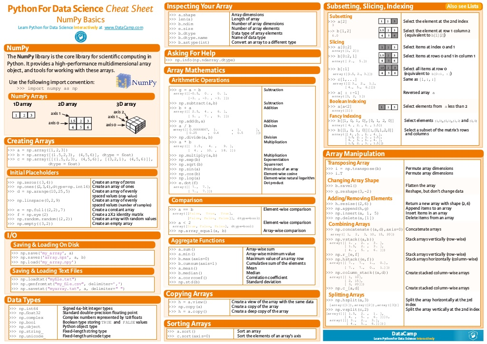

Basic consepts and operations from NumPy libraries. 

Quick notes, mathematical operations, subset operations, Fancy index.

00_all_in_one.ipynb includes all codes below the code list.

NumPy cheatsheet:

